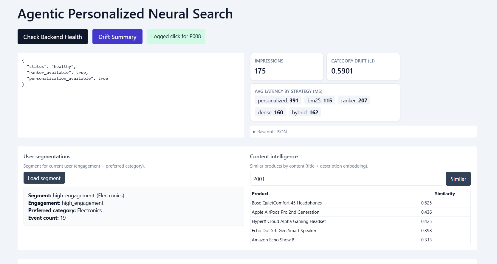
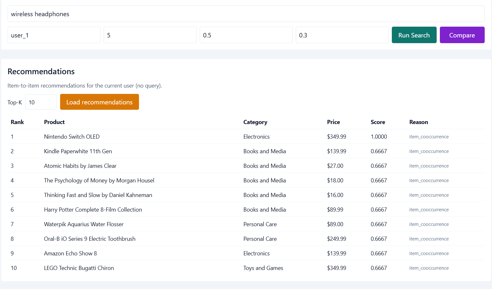
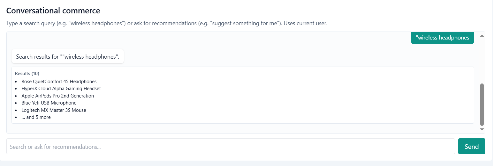
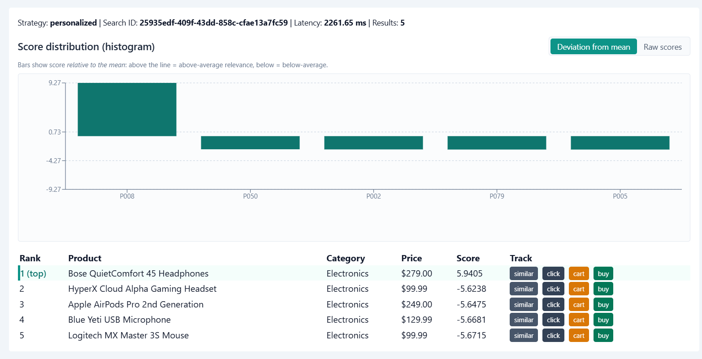

# Agentic Personalized Neural Search Engine

Production-style ML system for search relevance, personalization, recommendations, user segmentations, content intelligence, and conversational commerce.

## Screenshots

1. Dashboard: backend health, drift summary (impressions, category drift, latency by strategy), user segmentations, and content intelligence (similar products by embedding).



2. Search results: personalized strategy with score distribution histogram (deviation from mean) and results table (top result highlighted, similar/click/cart/buy).



3. Recommendations: item-to-item recommendations for the current user (no query).



4. Conversational commerce: chat-style search and recommendations (e.g. "wireless headphones" or "suggest something for me").




## What this project does

- End-to-end search pipeline: retrieval (BM25 + dense) → ranking (LambdaMART) → personalization (user embeddings). Same query returns different results per user.
- Recommendations: item-to-item co-occurrence recommender for non-query discovery.
- User segmentations: segment users by engagement (low/mid/high) and preferred category from interaction history.
- Content intelligence: similar products by content (title + description embeddings) via FAISS nearest neighbors.
- Conversational commerce: single endpoint that interprets messages as search queries or recommendation requests and returns product results.
- Evaluation & ops: NDCG/MRR/Recall/Precision, ablation studies, experiment tracking, drift analytics.
- Dashboard: Next.js UI with search, strategy comparison, score histogram (deviation/raw toggle), latency chart, recommendations panel, segment card, content-similar panel, and chat-style conversational UI.

## System architecture

### 1. Retrieval
- BM25 (`rank-bm25`) on `title + description`.
- Dense retrieval with Sentence Transformers; FAISS index for semantic search.
- Hybrid score combining sparse and dense signals.

### 2. Ranking
- LightGBM LambdaMART.
- Features: `bm25_score`, `cosine_similarity`, `hybrid_score`, `product_popularity`, `user_category_preference`, `query_length`, `price_match_indicator`.

### 3. Personalization
- User embeddings from weighted interaction history (`view` / `click` / `cart` / `purchase`).
- Personalized reranking via user–product embedding affinity.

### 4. Recommendation
- Item-to-item co-occurrence recommender (`agents/recommendation_agent.py`).
- Exposed via `GET /recommend`.

### 5. User segmentations
- Segments derived from interaction history: engagement level (event-count terciles) and preferred category.
- Segment label: `{engagement}_({category})` (e.g. `high_engagement_(Electronics)`).
- Exposed via `GET /user/{user_id}/segment` and `GET /segments`.

### 6. Content intelligence
- Similar products by content: same product embeddings (title + description) used for search; FAISS returns nearest neighbors for a given product ID.
- Exposed via `GET /content/similar?product_id=...&top_k=5`. Accepts IDs like `P002` or `2`.

### 7. Conversational commerce
- `POST /conversation` with `{ "user_id", "message" }`. Intent: "recommend" (e.g. "suggest for me") vs "search" (query). Returns product list accordingly.

## Repository structure

```text
agentic-personalized-neural-search/
├── agents/                  # retrieval, ranking, personalization, recommendation, segmentation
├── api/                     # FastAPI service
├── data/                    # input datasets (products.csv, interactions.csv)
├── docs/                    # technical design
├── evaluation/              # metrics, pipeline eval, ablation, error analysis
├── frontend/                # Next.js + TypeScript dashboard
│   ├── components/          # search-dashboard, score-histogram, latency-chart
│   └── lib/                 # API client
├── models/                  # model wrappers (ranker, user embedding)
├── runs/                    # experiment artifacts (logs, summaries; *.pkl in models/)
├── tests/                   # unit tests
├── utils/                   # preprocessing, feature engineering, experiment tracking
├── build_index.py           # build retrieval index + user embeddings
├── train_ranker.py          # train LambdaMART
├── main.py                  # backend / frontend / fullstack launcher
└── requirements.txt
```

## Run locally

```bash
pip install -r requirements.txt
python build_index.py
python train_ranker.py
python main.py --mode fullstack
```

- Backend only: `python main.py --mode backend` (API at http://127.0.0.1:8000).
- Frontend only: `python main.py --mode frontend` (after backend is running; app at http://127.0.0.1:3000).

Manual start:

```bash
uvicorn api.app:app --reload --port 8000
cd frontend && npm install && npm run dev
```

Optional: copy `frontend/.env.local.example` to `frontend/.env.local` and set `NEXT_PUBLIC_API_BASE` if the API is not at `http://127.0.0.1:8000`.

## API endpoints

| Method | Endpoint | Description |
|--------|----------|-------------|
| GET | `/health` | Service and ranker/personalization status |
| GET | `/search` | Search with `q`, `user_id`, `top_k`, `alpha`, `personalization_weight`, `strategy` (bm25 / dense / hybrid / ranker / personalized) |
| GET | `/recommend` | Item-to-item recommendations; `user_id`, `top_k` |
| GET | `/user/{user_id}/segment` | User segment (engagement, preferred category, event count) |
| GET | `/segments` | All segments and counts |
| GET | `/content/similar` | Similar products by content; `product_id`, `top_k` (IDs: e.g. `P002` or `2`) |
| POST | `/conversation` | Body: `{ "user_id", "message" }`; returns intent (search/recommend) and results |
| POST | `/events` | Log view/click/cart/purchase events |
| GET | `/analytics/drift` | Drift summary (impressions, category drift, latency by strategy) |

## Dashboard (frontend)

- Search: query, user ID, top-k, alpha, personalization weight; Run Search / Compare strategies.
- Strategy comparison: table (top-1 product, score, latency) + latency-by-strategy bar chart.
- Score distribution: histogram (deviation from mean or raw scores) with product IDs on X-axis.
- Results table: rank, product, category, price, score; top result highlighted; "similar" (content), click/cart/buy tracking.
- Recommendations: load item-to-item recommendations for current user.
- User segmentations: load segment for current user (engagement, preferred category).
- Content intelligence: product ID input + "Similar" to get similar-by-content list; or click "similar" on a search result.
- Conversational commerce: chat-style input; send a query or "suggest for me" and see results in the thread.
- Drift summary: cards for impressions, category drift (L1), avg latency by strategy; raw JSON in details.

## Evaluation and analysis

```bash
python evaluation/evaluate_pipeline.py
python evaluation/ablation_study.py
python evaluation/eda_error_analysis.py
```

Artifacts go to `runs/`. Summary table: `runs/experiment_summary.csv`.

## Experiment tracking

- Training/evaluation/ablation runs append to `runs/experiment_summary.csv`.
- Online logs: `runs/logs/impressions.jsonl`, `runs/logs/events.jsonl`.

## Technical design

See `docs/technical_design.md` for design and tradeoffs.

## Current limitations

- Labels are implicit from behavior events, not curated relevance judgments.
- Training queries are title-derived; offline metrics can be biased.
- Small dataset: ranking and personalization may be unstable.
- Recommendation is co-occurrence baseline, not sequence-aware.
- Segmentations and conversational intent are heuristic (no ML classifier).
